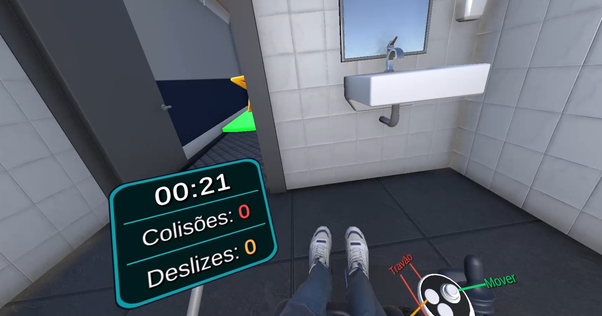
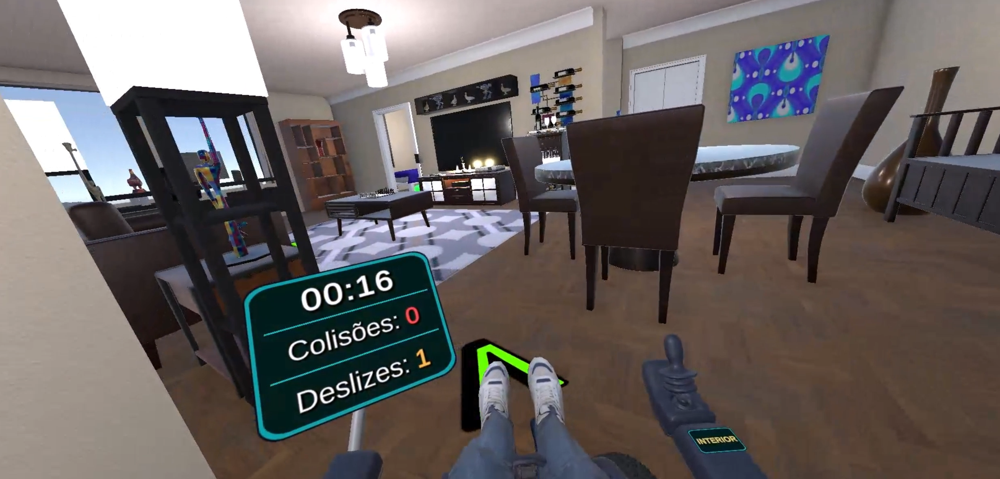
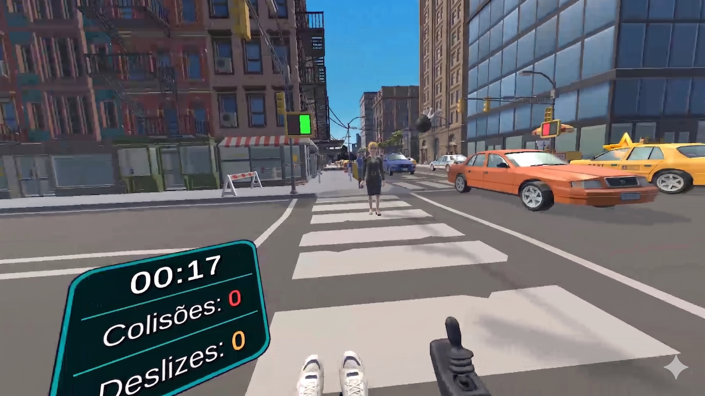
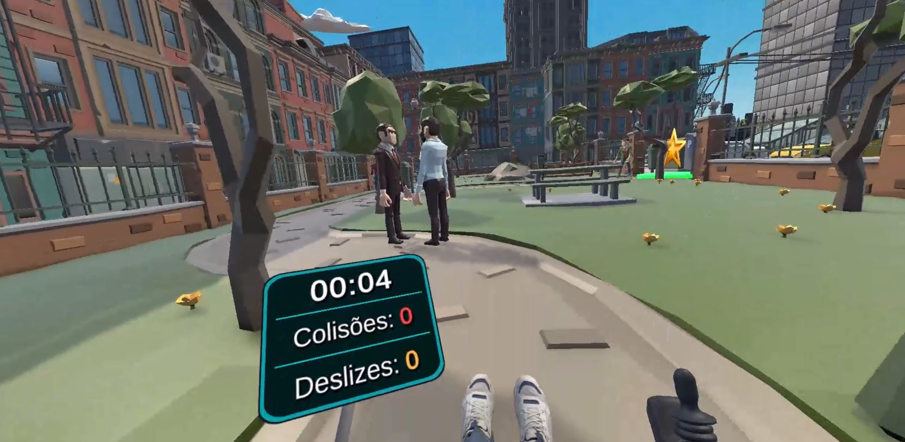

# VR Electric Wheelchair Driving Simulator

A Virtual Reality and PC simulator for safe electric wheelchair driving training.

## About

This simulator provides a safe, immersive environment for practising electric wheelchair driving. Driving an electric wheelchair takes motor coordination, spatial awareness, and quick reactions to obstacles — skills that need time and repetition to build, yet real-world training isn't always practical, requiring large spaces, constant supervision, and a wheelchair that may not be available. Built for rehabilitation contexts, this simulator removes those barriers, letting users develop and refine their driving skills at their own pace, as many times as they need.

It runs both as a fully immersive **Virtual Reality experience on the Meta Quest 3** and as a **desktop (PC) version** playable with keyboard and mouse.

## Screenshots

### Indoor

  
  

### Outdoor

  
  

## Features

- **10 progressive training levels** — Start with the fundamentals (straight-line driving, 90° and 180° turns, an obstacle course, reverse driving, and navigating a tight apartment), then move outdoors to real-world urban challenges: moving pedestrians, ramps, traffic lights, and pedestrian crossings.
- **Freestyle mode** — Explore an open virtual city with no time limit. Roam the streets to discover collectible stars scattered across the city, perfect for consolidating skills in a relaxed setting.
- **Two ways to play** — A fully immersive first-person VR experience on the Meta Quest 3, or a desktop version playable with keyboard and mouse.
- **Realistic wheelchair physics** — Acceleration, braking, and turning behave like the real thing. The VR version also lets you choose between front-wheel and rear-wheel steering.
- **Built-in gamification** — Earn one to three stars per level based on your performance, unlock levels as you progress, and get visual and audio rewards for clean runs.
- **Performance tracking** — Each patient has their own profile. Every run records the completion time, frontal and rear collisions, and lateral slips, with a full session history so progress can be reviewed over time.

## Download & Installation

The VR version is available on the **[Meta Horizon Store](https://www.meta.com/experiences/wheelchair-simulator/1157013487494015/)**. You can also download both versions from the **[itch.io page](https://lipepipo.itch.io/wheelchairsimulator)**.

### Virtual Reality version (Meta Quest 3)

**Requirements:** A Meta Quest 3 headset.

The easiest way to install is directly from the **[Meta Horizon Store](https://www.meta.com/experiences/wheelchair-simulator/1157013487494015/)** — just search for "Wheelchair Simulator" on your headset or follow the store link.

Alternatively, you can sideload the `.apk` from the [itch.io page](https://lipepipo.itch.io/wheelchairsimulator):

1. Download the **VR version** (`.apk` file) from itch.io.
2. Connect your Meta Quest 3 to your computer with a USB-C cable.
3. Install the `.apk` on the headset using one of these methods:
   - **SideQuest** (recommended) — install [SideQuest](https://sidequestvr.com/) on your PC, enable Developer Mode on the headset through the Meta Quest mobile app, then drag the `.apk` into SideQuest to install it.
   - **Meta Quest Developer Hub** — install [MQDH](https://developer.oculus.com/meta-quest-developer-hub/), connect the headset and upload the `.apk`.
4. On the headset, open the app from the library.

### PC / Desktop version

**Requirements:** Windows 10 or 11 (64-bit), a keyboard and a mouse.

1. Go to the [itch.io page](https://lipepipo.itch.io/wheelchairsimulator) and download the **PC version** (`.zip` file).
2. Extract the `.zip` file to a folder of your choice.
3. Open the extracted folder and run **`WheelchairSimulator.exe`**.

## Built With

- **Unity 3D** — game engine
- **C#** — programming language
- **Meta Quest 3** — VR headset support

## Links

- 🥽 **Meta Horizon Store:** [meta.com/experiences/wheelchair-simulator](https://www.meta.com/experiences/wheelchair-simulator/1157013487494015/)
- 🎮 **Play / Download:** [lipepipo.itch.io/wheelchairsimulator](https://lipepipo.itch.io/wheelchairsimulator)

## Acknowledgements

Developed in Unity 3D in partnership with the [Associação de Paralisia Cerebral de Braga](http://www.apcb.pt/) (APCB). This project makes wheelchair driving training accessible to everyone who needs it — one practice run at a time.